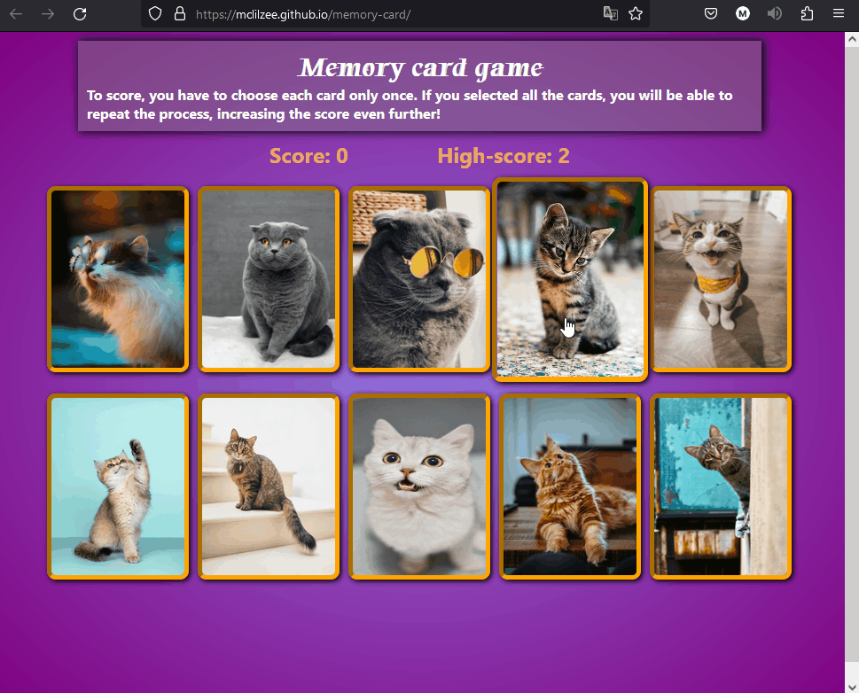

# <a href="https://mclilzee.github.io/memory-card">Memory Card Game</a>
A game to test your memory, you start by clicking the title above to be directed to the website, where you will start the game.
The game is simple, you are not supposed to click on the same image twice, if you do you will lose, your score will be saved and you will be shown the highest score.

There are 10 images, clicking on all of them will refresh the game by keeping your score, so you can repeat the process. You can simply click on the same image again as long as you already clicked on all 10 images, so the game can keep looping where you will be able to get higher and higher scores.

The game difficulty is harder than usual because cat pictures were chosen, and we all know how hard it is not to look and admire cat pictures. Which will most likely mess up with your memory, its for this purpose cat pictures were chosen.

# Examples

### Clicking Images to score

### Keeping high score after losing

# Credit
### Cat images

<a href="https://unsplash.com/@_k_arinn?utm_source=unsplash&utm_medium=referral&utm_content=creditCopyText">Karina Vorozheeva</a> on <a href="https://unsplash.com/s/photos/cat?utm_source=unsplash&utm_medium=referral&utm_content=creditCopyText">Unsplash</a>  
<a href="https://unsplash.com/@alxndr_london?utm_source=unsplash&utm_medium=referral&utm_content=creditCopyText">Alexander London</a> on <a href="https://unsplash.com/s/photos/cat?utm_source=unsplash&utm_medium=referral&utm_content=creditCopyText">Unsplash</a>  
<a href="https://unsplash.com/@sadmax?utm_source=unsplash&utm_medium=referral&utm_content=creditCopyText">Amber Kipp</a> on <a href="https://unsplash.com/s/photos/cat?utm_source=unsplash&utm_medium=referral&utm_content=creditCopyText">Unsplash</a>  
<a href="https://unsplash.com/@raouldroog?utm_source=unsplash&utm_medium=referral&utm_content=creditCopyText">Raoul Droog</a> on <a href="https://unsplash.com/s/photos/cat?utm_source=unsplash&utm_medium=referral&utm_content=creditCopyText">Unsplash</a>  
<a href="https://unsplash.com/@alvannee?utm_source=unsplash&utm_medium=referral&utm_content=creditCopyText">Alvan Nee</a> on <a href="https://unsplash.com/s/photos/cat?utm_source=unsplash&utm_medium=referral&utm_content=creditCopyText">Unsplash</a>  
<a href="https://unsplash.com/@bogdanf?utm_source=unsplash&utm_medium=referral&utm_content=creditCopyText">Bogdan Farca</a> on <a href="https://unsplash.com/s/photos/cat?utm_source=unsplash&utm_medium=referral&utm_content=creditCopyText">Unsplash</a>  
<a href="https://unsplash.com/@niuhang?utm_source=unsplash&utm_medium=referral&utm_content=creditCopyText">hang niu</a> on <a href="https://unsplash.com/s/photos/cat?utm_source=unsplash&utm_medium=referral&utm_content=creditCopyText">Unsplash</a>  
<a href="https://unsplash.com/@jaehunpark?utm_source=unsplash&utm_medium=referral&utm_content=creditCopyText">Jae Park</a> on <a href="https://unsplash.com/s/photos/cat?utm_source=unsplash&utm_medium=referral&utm_content=creditCopyText">Unsplash</a>  
<a href="https://unsplash.com/@e_d_g_a_r?utm_source=unsplash&utm_medium=referral&utm_content=creditCopyText">Edgar</a> on <a href="https://unsplash.com/s/photos/cat?utm_source=unsplash&utm_medium=referral&utm_content=creditCopyText">Unsplash</a>  
<a href="https://unsplash.com/es/@snowboardinets?utm_source=unsplash&utm_medium=referral&utm_content=creditCopyText">Max Baskakov</a> on <a href="https://unsplash.com/s/photos/cat?utm_source=unsplash&utm_medium=referral&utm_content=creditCopyText">Unsplash</a>
